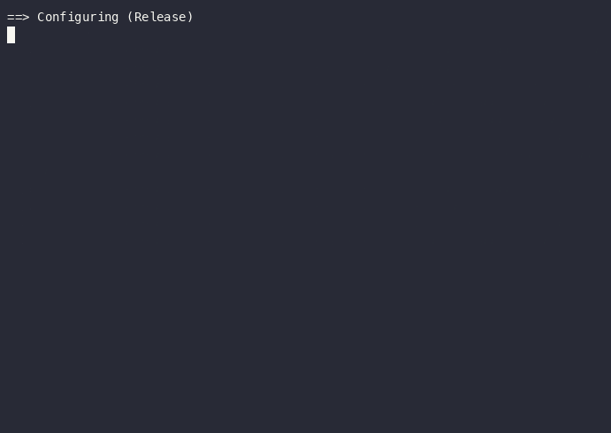

# Flux

A high-performance C++ limit order book and matching engine built for latency determinism. Processes real NASDAQ ITCH 5.0 market data with p50 latency of 55ns on real order flow.



*Demo runs the portable synthetic benchmark (`flux_bench`) on Apple Silicon — the
~73ns shown is not the 55ns p50 below, which was measured with `flux_latency` on
real ITCH data on an x86 Linux server. See [Reproducing the benchmarks](#reproducing-the-benchmarks).*

## Performance

Benchmarked on GT ECE x86 Linux server (GCC 8.5, -O3) using rdtsc nanosecond-precision timing on 1M samples from real NASDAQ ITCH 5.0 data:

| Metric | Latency |
|--------|---------|
| p50 | 55ns |
| p99 | 385ns |
| p999 | 700ns |

Processed 282,229,684 real NASDAQ messages (July 30, 2019 full trading day, 8.6GB).

## Architecture

### Core Data Structures

**Order** (`include/order.h`)
- `alignas(64)` — one order per cache line, single memory fetch per order lookup
- Fixed-size integer types for predictable memory layout
- `static_assert` verifying struct is exactly 64 bytes at compile time

**PriceLevel** (`include/price_level.h`)
- `std::deque<Order*>` — FIFO queue enforcing price-time priority
- Aggregate `total_quantity` for O(1) depth queries without walking the queue

**OrderBook** (`include/order_book.h`)
- `std::map` with `std::greater` comparator for bids — highest price first
- `std::map` with default comparator for asks — lowest price first
- `google::dense_hash_map` for O(1) order lookup by ID
- `PoolAllocator<Order, 1M>` — pre-allocated memory pool, no malloc on hot path

### Matching Engine
- Price-time priority (FIFO within price levels)
- Full and partial fill support across multiple price levels
- Incoming order matches against opposite side before insertion

### Memory Management
Custom pool allocator pre-allocates 1 million Order objects at startup. Allocation is a single pointer increment. Deallocation pushes to a free list. Zero heap allocation on the hot path.

### NASDAQ ITCH 5.0 Parser
Parses real binary market data with:
- `__attribute__((packed))` structs matching exact wire format
- `__builtin_bswap` for big-endian to little-endian conversion
- Handles Add ('A'), Cancel ('X'), Delete ('D'), Execute ('E') message types

## Key Design Decisions

| Decision | Rationale |
|----------|-----------|
| `alignas(64)` on Order | One order per cache line eliminates false sharing and reduces fetch count |
| `std::deque<Order*>` | FIFO naturally enforces price-time priority; pointer for pool compatibility |
| `dense_hash_map` over `unordered_map` | Contiguous memory layout eliminates pointer chasing between nodes |
| Pool allocator | Eliminates malloc jitter — p999 improved 3x; trades average latency for tail determinism |
| Templates over virtual functions | Zero runtime dispatch overhead, resolved at compile time |
| Pass Order by value in `add_order` | Quantity modified during matching — const ref would prevent this |

## Optimization Journey

Every optimization was benchmarked before and after. Some made things worse:

| Optimization | p50 | p99 | p999 | Notes |
|-------------|-----|-----|------|-------|
| Baseline | 269ns | 1272ns | 6862ns | Debug mode, Codespaces |
| + O(1) lookup map | 315ns | 1355ns | 19156ns | Hash map hurt L1 cache on synthetic benchmark |
| + Pool allocator | 473ns | 1755ns | 5850ns | Eliminated malloc spikes, added pointer indirection |
| + dense_hash_map | 399ns | 1504ns | 9248ns | Contiguous memory improved average case |
| + -O3, GT server | 55ns | 385ns | 700ns | Compiler optimization was the single largest win |

The O(1) lookup map made the synthetic benchmark worse (tiny working set fit in L1 cache, linear search was fast) but made real data throughput go from hours to minutes. Optimization tradeoffs depend entirely on access patterns.

## Building

### Prerequisites
- CMake 3.14+
- GCC/Clang with C++17 support
- Google Test
- Google Benchmark
- Google Sparsehash

### Linux (Ubuntu/Debian)
```bash
sudo apt-get install libgtest-dev libbenchmark-dev libsparsehash-dev
mkdir build && cd build
cmake .. -DCMAKE_BUILD_TYPE=Release
make
```

### Mac (Apple Silicon)
```bash
brew install googletest google-benchmark google-sparsehash
mkdir build && cd build
cmake .. -DCMAKE_BUILD_TYPE=Release
make
```

### Red Hat/CentOS (no sudo)
Install dependencies from source into `~/local`, then:
```bash
mkdir build && cd build
cmake .. -DCMAKE_BUILD_TYPE=Release
make
```

## Running

```bash
# Unit tests
./build/flux_tests

# Google Benchmark
./build/flux_bench

# p50/p99/p999 latency analysis on real ITCH data (x86_64 only, uses rdtsc)
./build/flux_latency <itch_file>

# Parse real NASDAQ ITCH 5.0 data
./build/flux_parser <itch_file>
```

NASDAQ ITCH 5.0 sample files available at: https://emi.nasdaq.com/ITCH/Nasdaq%20ITCH/

### Reproducing the benchmarks

`scripts/bench.sh` builds the project, runs the unit tests, and runs the portable
Google Benchmark suite in one command — no external data required:

```bash
./scripts/bench.sh
```

To also reproduce the p50/p99/p999 latency numbers on real order flow, pass the
path to a downloaded ITCH file (x86_64 only — `flux_latency` uses `rdtsc` for
cycle-accurate timing):

```bash
./scripts/bench.sh path/to.itch
```

## References

- [Carl Cook — When a Microsecond Is an Eternity (CppCon 2017)](https://www.youtube.com/watch?v=NH1Tta7purM)
- [charles-cooper/itch-order-book](https://github.com/charles-cooper/itch-order-book)
- [NASDAQ ITCH 5.0 Specification](https://www.nasdaqtrader.com/content/technicalsupport/specifications/dataproducts/NQTVITCHspecification.pdf)
